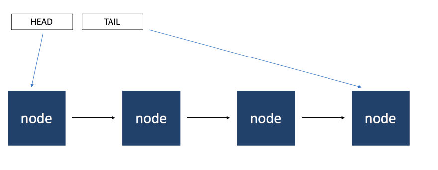
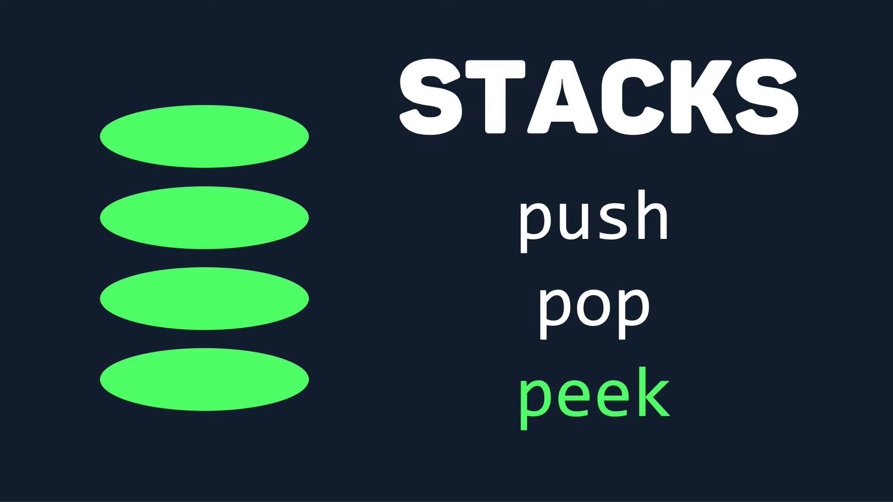

*Credit to TMU/Ryerson's CPS 305 course for teaching me about data structures and algorithms*

*Credit to Elshad Kamriov's Udemy Course for teaching me strctures in python*
https://www.udemy.com/course/data-structures-and-algorithms-bootcamp-in-python/

# Overview of Data Structures

Below -->>

## Linked Lists
- **Definition**: A linear collection of data elements, where each element points to the next, forming a sequence.
- **Key Features**:
  - Dynamic size.
  - Efficient insertion and deletion.
  - Sequential access (not random).
- **Types**:
  - Singly linked lists.
  - Doubly linked lists.
- **Use Cases**: Useful for applications with frequent addition and removal of elements where memory allocation is a concern.

## Arrays
- **Definition**: A collection of items stored at contiguous memory locations. 
- **Key Features**:
  - Fixed size.
  - Elements are of the same type.
  - Random access of elements using indices.
  - Efficient access and iteration.
- **Use Cases**: When you need fast access to elements using index, and the size of the collection is known and fixed.

## Queues
- **Definition**: A collection of entities that are maintained in a sequence and can be modified by adding at one end (the rear) and removing from the other end (the front).
- **Key Features**:
  - FIFO (First In, First Out) structure.
  - Enqueue (add) operations at the rear.
  - Dequeue (remove) operations at the front.
- **Use Cases**: Handling of data where the order of operations is essential, like task scheduling.

## Stacks
- **Definition**: A collection of elements with two main operations: push, which adds to the collection, and pop, which removes the most recently added element.
- **Key Features**:
  - LIFO (Last In, First Out) structure.
  - Push and pop operations.
- **Use Cases**: Useful in situations where a reverse order of operations is required, like undo mechanisms in text editors.

## Trees
- **Definition**: A hierarchical data structure with a root value and subtrees of children, each with a parent node.
- **Key Features**:
  - Non-linear.
  - Each node can have any number of children.
  - Trees are recursive data structures.
- **Types**:
  - Binary Trees.
  - AVL Trees.
  - Red-Black Trees, etc.
- **Use Cases**: Representing hierarchical data, like file systems, and for efficient searching and sorting.

## Hashmaps (Hash Tables)
- **Definition**: A data structure that implements an associative array abstract data type, a structure that can map keys to values.
- **Key Features**:
  - Key-value pairs.
  - Efficient insertion, deletion, and lookup.
  - Hash function to compute index for a key.
- **Use Cases**: When you need to access elements by a key, and efficiency is a concern. Common in database indexing.

This summary provides a basic understanding of each data structure, their key characteristics, and typical use cases.

# Tree Terminology and Types of Binary Trees

## Tree Terminology

- **Root**: The top node without a parent.
- **Edge**: A link between a parent and a child node.
- **Leaf**: A node which does not have children.
- **Sibling**: Children of the same parent.
- **Ancestor**: A parent, grandparent, great-grandparent, etc., of a node.
- **Depth of a Node**: The length of the path from the root to the node, measured in the number of edges.
- **Height of a Node**: The length of the path from the node to the deepest node connected to it. This length is measured by the number of edges.
- **Depth of the Tree**: The depth of the root node, which is always zero.
- **Height of the Tree**: The height of the root node.

## Types of Binary Trees

### Full Binary Tree
- Each node has either 0 or 2 children. No node has exactly 1 child.

### Perfect Binary Tree
- Every node other than leaf nodes has exactly two children.
- All leaf nodes are at the same level.
- The tree has exactly 2^(h+1) - 1 nodes, where `h` is the height of the tree.
- The number of leaf nodes is (n+1)/2 for a tree with `n` nodes.

### Complete Binary Tree
- Every level, except possibly the last, is completely filled.
- If the last level is not filled, nodes are as far left as possible.

### Balanced Binary Tree
- A tree where all leaf nodes are at the same distance from the root.

## Deepest Node in a Binary Tree
- The deepest node is the last node reached in a level order traversal.

## Tree Search Techniques

### Depth First Search (DFS)
1. **Preorder Traversal**: Visit the root node, then the left subtree, followed by the right subtree.
2. **Inorder Traversal**: Visit the left subtree, then the root node, and finally the right subtree.
3. **Postorder Traversal**: Visit the left subtree, the right subtree, and then the root node.

### Breadth First Search (BFS)
- **Level Order Traversal**: Visit each level from left to right.